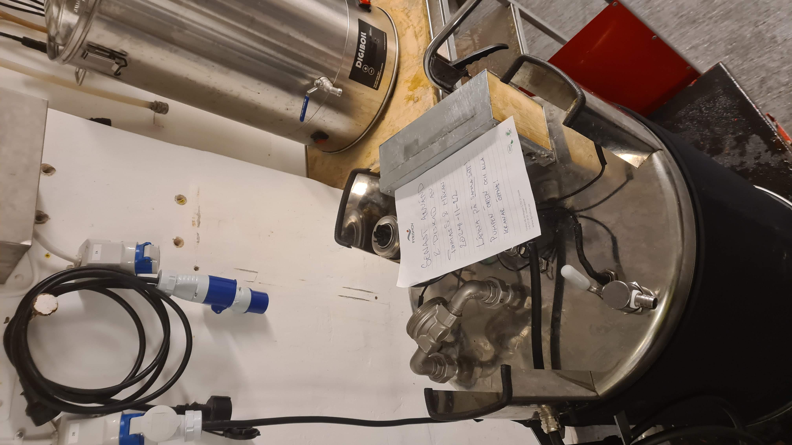
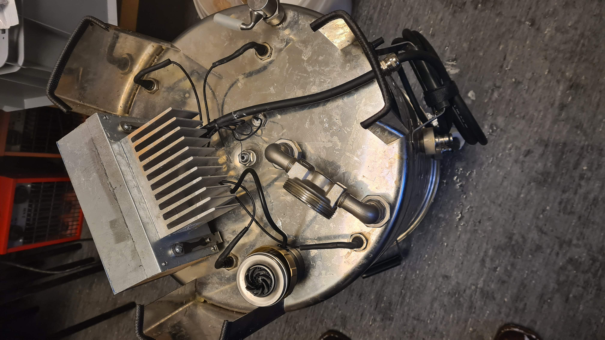
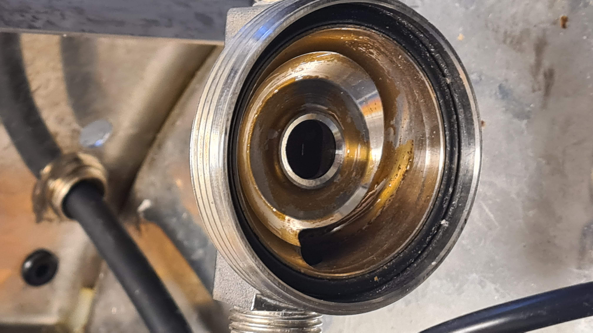
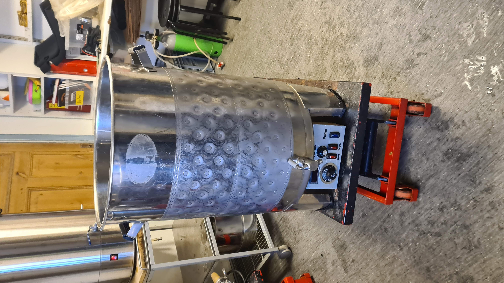
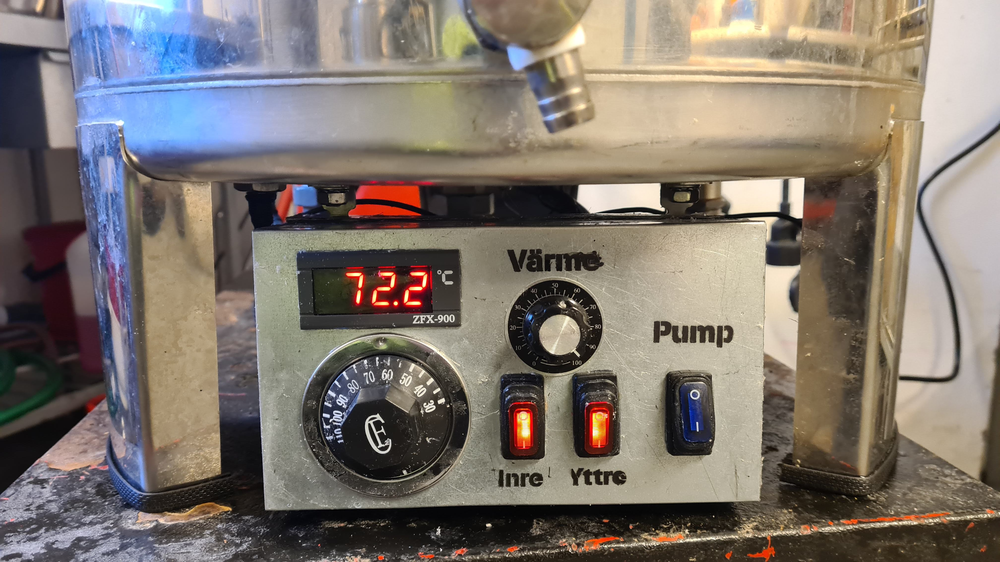
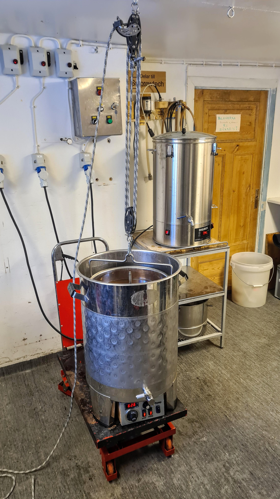
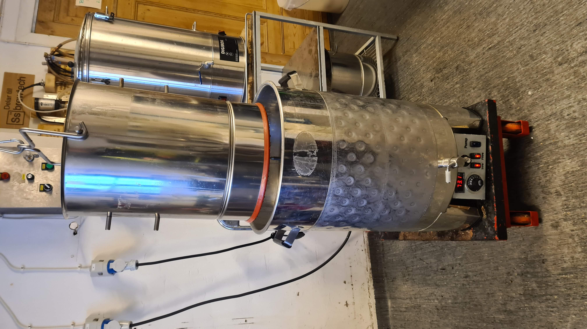

Manual BM50
===========

Detta är instruktioner som är tänkta att förklara hur man använder bryggverket Braumeister 50 (BM-50). För att den ska vara komplett och ge all information som behövs för alla så blir den med nödvändighet ganska lång.

> **Viktigt:**  
> Just med anledning av att hela manualen blir förhållandevis lång så finns det en särskild formatering för stycken som innehåller viktig information. Läs gärna hela manualen, som också innehåller bra tips, men säkerställ verkligen att du läst och förstått alla de avsnitten innan du använder bryggverket.

På slutet finns också en sammanfattning av processen för att det ska vara lättare att få en överblick på allt.

---

När du kommer till brygglokalen finner du BM-50 bryggverket ställt upp och ner på en rullvagn under skrivbordet. När man är klar med bryggningen lämnar man den på samma sätt, och berättar vem som använt och rengjort bryggverket efter sig. Om det är så att det varit några problem eller annat som är viktigt att berätta för nästa så ska detta givetvis antecknas även det.

Montering av pump
-----------------

Om tidigare bryggare har följt instruktionerna så ska det finnas en lapp som berättar vem som använt bryggverket senast och eventuellt någon anteckning om det varit något som noterats vid dennes bryggning. Skänk även en tanke av tacksamhet för att det är så noggrannt diskat och prydligt uppställt.

Den pump som cirkulerar vörten under bryggningen skall lämnas uppställd på botten av bryggverket med sladden inkopplad enligt bild 1. Detta är för att det inte ska bli stående vatten med eventuella rester av tidigare brygd som möglar och förstör för nästa bryggare.
 

Innan man ställer bryggverket på plats ska pumpen monteras. Denna pump har ett vred som styr hur kraftigt den cirkulerar. Det är lagom att ha den på läge 4-5 för BM-50 bryggverket. Att ställa den högre ökar risken för att man sätter igen maltbädden under bryggningen. Lägre blir cirkulationen svagare vilket kan påverka utbytet enligt tillverkaren.

Kontrollera att det finns en packning i kanten på pumphuset. Den är tunn, av svart gummi och ska inte ha några brott eller klämskador. Normalt sitter den kvar i spåret men det händer att den kommer loss och då är det bara att lägga i den så att den ligger på plats när man monterar pumpen.

Pumpen monteras genom att hållas mot pumphuset och skruvas fast genom den löpande gäng-ring som sitter på pumpen. Den ska kunna skruvas ca 3 var utan motstånd och sedan bottna relativt distinkt. Det räcker med att dra åt med finger-kraft, att använda mer än så skadar bara packningen och gör inte att det blir mer tätt. 

När pumpen sitter på plats är det dags att ställa bryggverket på plats. Maltpipan som ska monteras i bryggverket förvaras under bryggverket så lyft gärna lite försiktigt och rätt upp. Placera bryggverket på en av de vagnar som finns i bryggeriet. Det underlättar många moment om man kan flytta runt bryggverket och höja upp det när man ska tappa ur.

Dags att fylla på vatten, men först lite mer om kontrollenheten.

Kontrollenheten
---------------

På grund av att vi haft återkommande problem med de kontrollenheter som följer med bryggverken har vi valt att istället sätta dit en helt manuell styrning. (Ja, den är också hembyggd)

Kontrollenheten är uppbyggd i tre sektioner. 

Längs till vänster finns en sektion för temperatur där det sitter en termometer överst och ett vred som styr en termostat. Denna används för att ställa högsta temperatur och den bryter strömmen till värmelementen när ställd temperatur nås. Det är en mekanisk termostat som styrs av en gasfylld cylinder som monterats innuti bryggverktes centrumrör. Det är en pålitlig konstruktion men den är förhållandevis grov och markeringarna på vredet sitter ungefär 10 grader för lågt. Man behöver därför använda termometern för att hålla lite koll på vad den faktiska temperaturen är. Om man vrider på vredet hör man ett tydligt klick när den slår av och till. 

På mittendelen av kontrollenheten finns dels ett reglage för att styra effekten och dels två röda brytare för att slå på eller av elementen. Enheten har två element, ett inre och ett yttre som sitter på var sin sida maltpipan vid bryggning. Med hjälp av prytarna kan elementen användas obeoroende av varandra. På detta vis kan man anpassa hur bryggverket värmer under de olika faserna av bryggningen.  

> **VIKTIGT:**   
> En av de viktigaste sakerna att tänka på när man använder bryggverken är att säkerställa att värmeelementen ***ALDRIG*** körs torra.
> Elementen är konstruerade för att vatten ska leda bort värme när de används. Om de körs torra riskerar de att bli så varma att värmetråden bränns av och därtill så kommer eventuell vört som fanns på dem att brännas fast, vilket är jättejobbigt att diska rent. Till skillnad från originalenheten får man ingen motfråga när man startar utan man måste själv ta ansvar för att de alltid står på 0 när det inte finns vatten eller vört i bryggverket. 

Längst till höger finns en (blå) brytare som styr cirkulationspumpen. Till skillnad från originalets styrenhet finns här ingen automatisk paus utan man får själv komma ihåg att stanna den då och då under bryggningen om man vill venitlera maltbädden. Mer om det under avsnittet om bryggning. 

Förbereda bryggning
-------------------

När bryggverket står på plats är det dags att fylla på vatten. Det lättaste är att använda samma slangar som vi använder till kylning. Det sitter Gardenakopplingar på väggen och den som har två kopplingar går till kallvatten. 

Braumeisters bryggverk är konstruerade för att använda en viss mängd malt och vatten vid bryggning, för BM-50 är det bäst att använda 10-12 kilo malt, vilket är vad som ryms i maltpipan. Det finns även en kortare maltpipa som används för bryggningar med 5-6 kg malt. På samma sätt behöver det användas tillräckligt med vätska för att den ska kunna pumpas runt under själva bryggningen. Det finns graderingar på centrumröret som markerar de tänkta mängderna vatten, men det beror givetvis även på hur mycket malt man använder. 

Denna kontrollenhet några praktiska fördelar i förhållande till originalets version. I och med att man kan slå av det yttre elementet under bryggningen så behöver man inte ha så mycket vätska att detta täcks. Man kan således brygga med mindre vätska i vörten vilket gör att man kan använda mer vatten vid lakning vilket höjer utbytet. Man slänger helt enkelt mindre socker om man tvättar maltbädden med mer vatten under lakningen.

Vi rekommenderar därför att man vid 12 kg malt använder ca ?? liter vatten vilket är ca 2 cm under det tredje strecket uppifrån på mittaxeln. Oavsett är det alltid en bra idé att ha lite extra vatten värmt för den händelse att man upptäcker att man behöver mer. Det är alltid surt att behöva vänta på uppvärmning då.

När du slagit i vatten är det dags att koppla in bryggverket. Den drar så pass mycket ström att vi försett den med kontakt och kabel som klarar 16 ampere kontinuerlig last. Den ska därför kopplas in på en av de blå 1-fas uttag som sitter på väggen till höger om diskbänken. Använd det vänstra eller mittersta eftersom det högra har en reglerbar effektbegränsning som inte ska användas för bryggverk.

Sedan ställer du termostaten ungefär på den temperatur du vill ha för inmäskning. Termostaten är mekanisk och reglerar hur högt verket värmer vattnet. Det blir den övre gränsen där elementen kopplas ifrån helt. Den är särskilt exakt och skalan är  precis så man behöver kontrollera vad det blir innan man går till bryggning. När man värmer bryggvattnet är det en bra ide att cirkulera vätskan med pumpen eftersom det gör värmningen mer effektiv.

En annan fördel med den manuella styrningen är att man inte har den märkliga begränsning som finns i originalehentens program kring temperatursteg. Man kan därmed ställa temperaturen några grader högre för att kompensera för det temperaturfall som den kalla malten orsakar när man mäskar in. Hur många grader som tappas beror på mängden malt och givetvis på vilken temperatur vi har på vinden vid tillfället. Det är lämpligt att räkna på ca t grader vintertid och t-4 grader sommartid vid 12 kg malt.

Det tar ca XY minuter att värma vattnet till 70 grader så det är ett bra tillfälle att mäta och krossa malt samt att tappa upp lakvatten i lakvattenvärmaren.

Montera maltpipa
----------------

Maltpipan förvaras på samma rullvagn som bryggverket. Övriga delar hänger på väggen vid trappen ner till källaren. 

1. Nedre packning
2. Silplåtar
3. Sildukar
4. Topstag
5. Mutter
6. Lyftstag

Börja med packningen som monteras på den raka delen av pipan som sedan ska ställas nedåt, mellan de yttre och inre värme-elementen.

Nästa del i konstruktionen är silplåtar och silnät som träs över pinnen i den ordningen. Silplåten monteras med rörpipen uppåt och med nätet trätt över den. Det kommer att fastna på en fals i nedre delen av maltpipan och hålls där några cm ovanför värme-elementet.

Det räcker med att sätta dit dessa delar innan man påbörjar inmäskning men det kan även vara lämpligt att temporärt montera topstag och muttern för att spänna ner pipan på plats. Därigenom eliminerar man risken att maltpipan rubbas under den omrörning som ibland blir ganska kraftig. 

Inmäskning
----------

> **Viktigt:**  
> Börja med att ställa ner termostaten några grader så att den står vid din tänkta inmäskningstemperatur. Slå även av brytaren för det yttre värme elementet. Under bryggningen använder vi bara det inre, som räcker mer än väl för att hålla vörten vid rätt temperatur.

Inmäskningen är med anledning av själva konstruktionen en aning krånglig och kan bli ibland bli rent frustrerande i de här bryggverken. Det är både lätt att råka, och samtidigt viktigt att inte, spilla malt bredvid så att den hamnar på utsidan.  Den kommer ofelbart hamna i pumpen och riskerar då att sätta igen pumpen så att cirkulationen inte fungerar. Det är lättare om man använder en mindre maltskopa och öser ner malten försiktigt. 

Därtill behövs det mesta av vattnet för att blöta upp malten och säkerställa att det inte blir "torrbollar" i maltbädden. Haken är att pumpen inte har någon ventil vilket gör att det finns en öppen kanal mellan inre yttre utrymmet i bryggverket. Även om man lätt pumpar över vätskan till den inre kammaren så kommer gravitationen göra att den långsamt läcker tillbaka.

För att runda av är det dessutom ganska knöligt att komma åt att röra. Av den anledningen har vi skaffat en visp som kan användas med skruvdragaren på vinden, men även med den är det lätt att stänka runt malt. Var därför försiktig och metodisk.

Gör så här:  
Börja med att skeda ner ett ungefär en tredjedel av malten och rör runt. Du kommer att märka att malten blir mer kompakt när den blöts ner men även att det blir allt tyngre att arbeta när gröten blir mer torr. Fyll på med mer malt tills det är trögt att röra.

En del av vattnet är som sagt på utsidan av maltpipan men det är lyckligtvis enkelt att få över den på rätt sida igen. Antingen öppnar man sidoventilen och fyller över ett litermått med vatten/vört som man sedan häller i maltpipan. Eller så startar man helt enkelt pumpen, men då måste man se upp så att det inte svämar över när man håller på (det är ett annat sätt att få över malt på fel sida).

Med mer vatten blir det enklare att röra men som sagt, det är inget som hindrar det från att rinna tillbaka genom pumpen igen så det blir till att arbeta iterativt i omgångar med vatten, malt och omrörning.

Det är lite trixigt men man lär sig ganska snart. Om man tycker att detta moment är problematiskt så kan givetvis göra på vanligt sätt med en "dough-in" i en av kastrullerna. Blanda då malt och vatten i en kastrull eller valfritt kärl och sleva ner den redan uppblötta malten i maltpipan istället.

När all malt är ihälld och omrörd sätter man på den övre silen. Silduken ska läggas först så att den är närmast malten. Sedan är det den övre silplåten och till sist topstaget och vingmuttern som håller allt nere.

> **Viktigt:**  
> Det behövs en liten distans mellan toppen av pipan och den övre silplåten. Det uppnår man om man vänder den lilla rörpipan uppåt. Alternativt kan man använda distanser som vi skurit till av kopparrör. Utan den distansen kommer det med stor sannolikhet tryckas malt genom springan som uppstår mellan maltrör och silplåt.

Med allt på plats är det dags att starta pumpen. Om allt är rätt så ska det långsamt svämma över kanten och pumpas runt. På utsidan ska det finnas någon centimeter vört som cirkulerar runt. Om det är för lite vätska är det bara att fylla på med lite mer vatten. Är det mer vätska så är det inte någon katastrof men det minskar mängden vatten som du sedan kommer att kunna laka med.

Bryggning
---------

Med ett bryggverk så är själva bryggningen inte särskilt dramatisk. Man behöver hålla koll på temperaturen samt att vörten cirkulerar i lagom takt. Med det manuella reglagen så behöver man hålla lite koll på processen och justera vartefter. Termostaten har ett par graders hysteres så man kan få röra den någon m.m. åt endera håll om det är på väg för långt och så var det pumpen som man bör pausa någon minut ungefär var tionde minut för att minska risken att maltbädden sätts igen.

Det kan känns lite "steam-punk" om man är van vid touch-paneler och apparater som piper och blinkar, men det är samtidigt inte så dumt att ha allt i egen kontroll. 

> *TIPS:*  
> Om du vill stegmäska är detta med en mindre mängd vätska när man startar bryggningen också en fördel. Då kan man enkelt tillsätta ett par liter kokande vatten när man vill stega upp temperaturen och därigenom få stegningen snabb utan att karamellisera sockret med heta värmeelement.

Under bryggningen är det givetvis viktigt att värma vatten till lakning. Vi har en dedikerad lakvattenvärmare och enklast är att värma i den eftersom den har en termostat som stoppar vid den temperatur man ställer in. Hur mycket lakvatten du behöver beror givetvis på typ av öl men för en normalstark öl med OG går det åt upp till z liter vid ett bra utbyte.

Lakning
-------

Börja med att så av pumpen och skruva sedan av vingmuttern och ta bort topstaget.

Vid lakning sköljer man maltbädden för att få ur allt socker genom att slå på varmt vatten ovanifrån. Normalt lakar man med 74-78 grader varmt vatten. 

I början rinner vörten genom pumpen och ut i den yttre kammaren. Så länge det finns en höjdskillnad där kan man fylla på med vatten i den takt det rinner undan så att det alltid är någon cm vätska ovanpå silplåten. 

När det börjar gå långsamt höjer man maltpipan allt eftersom man fyller med mer vatten. Den är för tung för att man ska hantera den bekvämt och det är dessutom ganska mycket varmt vatten som vi hanterar. Av den anledningen har vi ett spel monterat i taket som ska användas för att hissa upp maltpipan på ett säkert sätt. Det monteras genom att det block som har en karbinhake kopplas till lyftstaget som sedan hakas i maltpipan enligt bilden nedan.

Haka karbinhaken i lyftstaget enligt bilden. Det kan vara lite trixigt att få kärlet precis under kroken så att det lyfts rakt upp och det är här kärran är praktisk eftersom den gör det lätt att flytta runt allt. 

Repet passerar en skotråtta som stoppar repet från att åka tillbaka när man börjar spänna. Det minimerar risken att man tappar tillbaka maltpipan ner i den heta vörten vilket är en av de mer riskfyllda incidenter som hänt i vår lokal. Detta block är lindat 4 gånger vilket innebär att du får 4 gångers utväxling på kraften. Det är därmed lätt att lyfta trots att pipan är tung.

Med bryggverket på en vagn är det även lätt att köra undan vagnen när lakningen är klar och sedan sänka ner maltpipan på en spillbricka. Det är precis så att vagnen går fritt när blocken är i sitt högsta läge.

Redan när båda elementen är täckta av vätska kan man slå på dem för att påbörja uppvärmning mot kok. Det är bara att gå på med full effekt på båda elementen.

Kok
----

Hotbreak och värmereglering.

Humlekorg

Kylning
-------

Inkoppling av kyla i manteln samt kylspiral

Whirlpool

Avtappning
----------

Syresättningsspridare

Rengöring
--------

Tips och tricks
---------------

Felsökning
----------

Jag verkar inte få någon riktig effekt när jag ska värma/koka:  
Man kan enkelt kontrollera den effekt som går till elementen genom att se om dioderna i strömbrytarna lyser tydligt. Om inte är det något som är knasigt?
Är båda elementen på och är effektregleraren på max?  
Har en säkring gått?
Har någon av huvudsäkringarna ute i skåpet gått?
