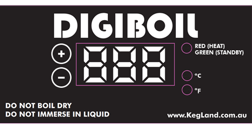

DigiBoil
========
Vår Digiboil är inte ett bryggverk utan har till uppgift att vara en dedikerad lakvattenvärmare. Den har integrerade element och en termostat som man ställer för att bestämma vilken temperatur den ska värma till. 

Det sitter även en värmeväxlare monterad i den för att den ska kunna användas som en HERMS när man brygger med våra Brewtech kärl, men det går utmärkt att använda den som lakvatten värmare även när man brygger med våra andra bryggverk.

Det är därför bara tänkt att man ska använda den för lakvatten. Om man försöker koka vört i den så kommer man att skaffa sig ett avancerat rengöringsarbete för att få den i skick att hantera lakvatten igen.

Användning
----------
**Observera:** Innan du slår på enheten **måste** du säkerställa att det finns åtminstone lite vatten i kärlet. Det är en mekanisk konstruktion och den kommer att börja värma omedelbart om temperaturen är under den inställda måltemperaturen, vilket den i praktiken alltid är när den är tom eftersom den normalt tidigare har används vid bryggning. I och med att den tar skada av att köras torr så måste man säkerställa att det finns något att värma när den slås på.

Till vänster finns en huvudströmbrytare som man kan använda för att slå hela enheten av eller på. 

Ställa temperatur
-----------------

Centralt finns en display som visar aktuell temperatur i kärlet samt knappar för att styra måltemperatur. När den slås på visar den inställda måltemperaturen några sekunder och går sedan över till att visa aktuell temperatur. När enheten är i drift visar den normalt den aktuella temperaturen i kärlet.

Till höger om temperaturen finns ett par led-lampor som dels visar vilken skala som används och dels visar om elementen värmer aktivt för tillfället.

Till vänster finns två knappar för + och -. För att kontrollera vilken mål-temperatur som är inställd kan man trycka en gång på någon av dem. För att ändra temperaturen trycker man bara fortsatt på knapparna för att komma till den temperatur man söker (0-100). Dioden som indikerar värme blinkar då under 4 sekunder och sedan är enheten inställd på den nya temperaturen.

Välja effekt
------------

På och på höger sida om termostatens panel finns tre brytare som styr vilka av de tre värme-element som används. Genom att de kan användas oberoende av varandra kan man reglera effekten i 7 steg mellan 0,5 och 3,5 kW.

Alla element är kopplade via termostaten som regleras på panelen. Termostaten har ingen PID logik utan värmer för fullt tills termostaten slår från. Därefter har den ett läge med underhållsvärme med begränsad effekt vilket illustreras av en grön led. Den har ca 1 grads hysteres.

Rengöring
---------
I och med att vi bara använder den för att värma vatten finns ett mycket litet behov av rengöring. Den ska givetvis inte lämnas med vatten i eftersom det surnar om det får stå. Helst ska den förvaras torr så ställ den upp och ner i diskhon en liten stund och lämna den sedan med locket av så att all fukt torkar ur.

Tillverkarens manual finns [sparad här](img/digiboil_usermanual.pdf).